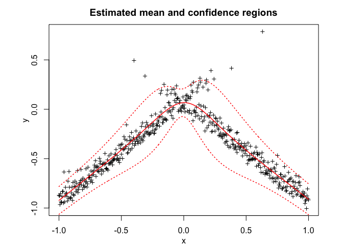
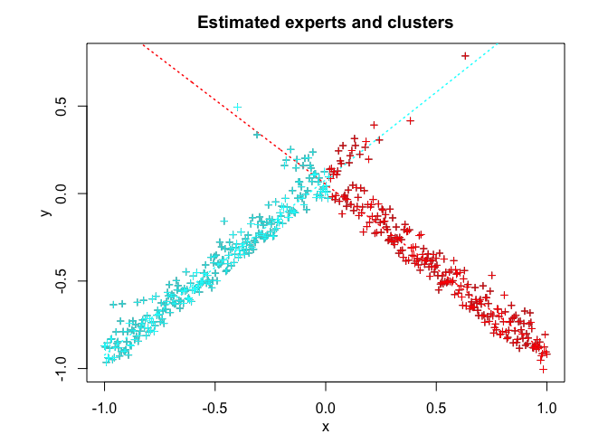
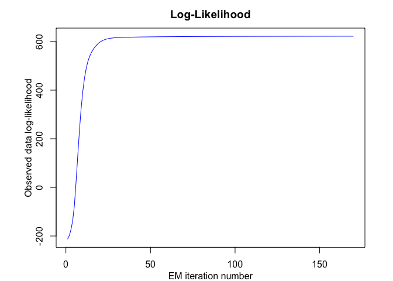

<!-- README.md is generated from README.Rmd. Please edit that file -->

## Overview

<!-- badges: start -->

<!-- badges: end -->

User-friendly and flexible algorithm modelling, sampling, inference, and
clustering heterogeneous data with the Skew-t Mixture-of-Experts (StMoE)
model.

## Installation

You can install the development version of StMoE from
[GitHub](https://github.com/) with:

``` r
# install.packages("devtools")
devtools::install_github("fchamroukhi/StMoE")
```

To build *vignettes* for examples of usage, type the command below
instead:

``` r
# install.packages("devtools")
devtools::install_github("fchamroukhi/StMoE", 
                         build_opts = c("--no-resave-data", "--no-manual"), 
                         build_vignettes = TRUE)
```

Use the following command to display vignettes:

``` r
browseVignettes("StMoE")
```

## Usage

``` r
library(StMoE)

data("simulatedstructureddata")
fData <- FData$new()
fData$setData(simulatedstructureddata$X, simulatedstructureddata$Y)

K <- 2 # number of regimes (mixture components)
p <- 1 # dimension of beta (order of the polynomial regressors)
q <- 1 # dimension of w (order of the logistic regression: to be set to 1 for segmentation)

modelStMoE <- ModelStMoE(fData, K, p, q)

n_tries <- 1
max_iter = 1500
threshold <- 1e-5
verbose <- TRUE
verbose_IRLS <- FALSE

solution <- EM(modelStMoE, n_tries, max_iter, threshold, verbose, verbose_IRLS)

solution$plot()
```


