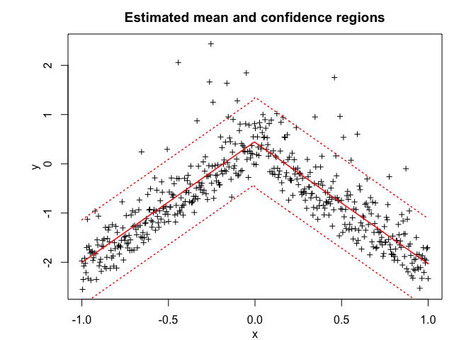
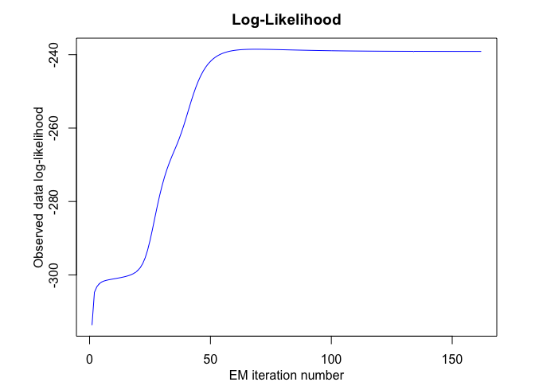

<!-- README.md is generated from README.Rmd. Please edit that file -->

<!-- badges: start -->

<!-- badges: end -->

# Overview

User-friendly and flexible algorithm modelling, sampling, inference, and
clustering heterogeneous data with the Skew-t Mixture-of-Experts (StMoE)
model.

# Installation

You can install the development version of StMoE from
[GitHub](https://github.com/) with:

``` r
# install.packages("devtools")
devtools::install_github("fchamroukhi/StMoE")
```

To build *vignettes* for examples of usage, type the command below
instead:

``` r
# install.packages("devtools")
devtools::install_github("fchamroukhi/StMoE", 
                         build_opts = c("--no-resave-data", "--no-manual"), 
                         build_vignettes = TRUE)
```

Use the following command to display vignettes:

``` r
browseVignettes("StMoE")
```

# Usage

``` r
library(StMoE)
```

``` r
n <- 1000 # Size of the sample
K <- 2 # Number of regressors/experts
p <- 1 # Order of the polynomial regression (regressors/experts)
q <- 1 # Order of the logistic regression (gating network)

alphak <- matrix(c(0, 8), ncol = K - 1) # Parameters of the gating network
betak <- matrix(c(0, -1, 0, 1), ncol = K) # Regression coefficients of the experts
sigmak <- c(0.1, 0.1) # Standard deviations of the experts
lambdak <- c(3, 5) # Skewness parameters of the experts
nuk <- c(5, 7) # Degrees of freedom of the experts network t densities
x <- seq.int(from = -1, to = 1, length.out = n) # Inputs (predictors)

# Generate sample of size n
sample <- sampleUnivSTMoE(alphak = alphak, betak = betak, sigmak = sigmak, 
                          lambdak = lambdak, nuk = nuk, x = x)

n_tries <- 1
max_iter <- 1500
threshold <- 1e-5
verbose <- TRUE
verbose_IRLS <- FALSE

stmoe <- emStMoE(x, matrix(sample$y), K, p, q, n_tries, max_iter, 
                 threshold, verbose, verbose_IRLS)
#> EM: Iteration: 1 || log-likelihood: -376.437004674711
#> EM: Iteration: 2 || log-likelihood: -363.079030022639
#> EM: Iteration: 3 || log-likelihood: -296.637984001209
#> EM: Iteration: 4 || log-likelihood: -164.9109075866
#> EM: Iteration: 5 || log-likelihood: 49.5989106293945
#> EM: Iteration: 6 || log-likelihood: 320.153162277561
#> EM: Iteration: 7 || log-likelihood: 609.907698301445
#> EM: Iteration: 8 || log-likelihood: 770.83395308758
#> EM: Iteration: 9 || log-likelihood: 894.665432843188
#> EM: Iteration: 10 || log-likelihood: 953.61517222038
#> EM: Iteration: 11 || log-likelihood: 993.466726540979
#> EM: Iteration: 12 || log-likelihood: 1017.83331187165
#> EM: Iteration: 13 || log-likelihood: 1035.01058452584
#> EM: Iteration: 14 || log-likelihood: 1047.38570419144
#> EM: Iteration: 15 || log-likelihood: 1056.57307567484
#> EM: Iteration: 16 || log-likelihood: 1063.4847117265
#> EM: Iteration: 17 || log-likelihood: 1068.72009042464
#> EM: Iteration: 18 || log-likelihood: 1072.72918517205
#> EM: Iteration: 19 || log-likelihood: 1075.83908739788
#> EM: Iteration: 20 || log-likelihood: 1078.28304615775
#> EM: Iteration: 21 || log-likelihood: 1080.23313346211
#> EM: Iteration: 22 || log-likelihood: 1081.81250410407
#> EM: Iteration: 23 || log-likelihood: 1083.10902734926
#> EM: Iteration: 24 || log-likelihood: 1084.18845657858
#> EM: Iteration: 25 || log-likelihood: 1085.09898224137
#> EM: Iteration: 26 || log-likelihood: 1085.8761159533
#> EM: Iteration: 27 || log-likelihood: 1086.54617689031
#> EM: Iteration: 28 || log-likelihood: 1087.12878611288
#> EM: Iteration: 29 || log-likelihood: 1087.63885365686
#> EM: Iteration: 30 || log-likelihood: 1088.0873736729
#> EM: Iteration: 31 || log-likelihood: 1088.4843068592
#> EM: Iteration: 32 || log-likelihood: 1088.83748255296
#> EM: Iteration: 33 || log-likelihood: 1089.15315541559
#> EM: Iteration: 34 || log-likelihood: 1089.43629605232
#> EM: Iteration: 35 || log-likelihood: 1089.69103844425
#> EM: Iteration: 36 || log-likelihood: 1089.92081683859
#> EM: Iteration: 37 || log-likelihood: 1090.1285140232
#> EM: Iteration: 38 || log-likelihood: 1090.31658578009
#> EM: Iteration: 39 || log-likelihood: 1090.48714188583
#> EM: Iteration: 40 || log-likelihood: 1090.64200815349
#> EM: Iteration: 41 || log-likelihood: 1090.78277774376
#> EM: Iteration: 42 || log-likelihood: 1090.91084673985
#> EM: Iteration: 43 || log-likelihood: 1091.02741082069
#> EM: Iteration: 44 || log-likelihood: 1091.13348682661
#> EM: Iteration: 45 || log-likelihood: 1091.23006314025
#> EM: Iteration: 46 || log-likelihood: 1091.31804033687
#> EM: Iteration: 47 || log-likelihood: 1091.398276334
#> EM: Iteration: 48 || log-likelihood: 1091.47135736978
#> EM: Iteration: 49 || log-likelihood: 1091.53786203616
#> EM: Iteration: 50 || log-likelihood: 1091.5982743021
#> EM: Iteration: 51 || log-likelihood: 1091.6531654079
#> EM: Iteration: 52 || log-likelihood: 1091.70305494122
#> EM: Iteration: 53 || log-likelihood: 1091.74840799171
#> EM: Iteration: 54 || log-likelihood: 1091.78989654793
#> EM: Iteration: 55 || log-likelihood: 1091.82763317141
#> EM: Iteration: 56 || log-likelihood: 1091.86191210452
#> EM: Iteration: 57 || log-likelihood: 1091.89299693954
#> EM: Iteration: 58 || log-likelihood: 1091.9211828592
#> EM: Iteration: 59 || log-likelihood: 1091.94674191193
#> EM: Iteration: 60 || log-likelihood: 1091.96991096255
#> EM: Iteration: 61 || log-likelihood: 1091.99089745729
#> EM: Iteration: 62 || log-likelihood: 1092.00988569451
#> EM: Iteration: 63 || log-likelihood: 1092.02704135707
#> EM: Iteration: 64 || log-likelihood: 1092.04251466117
#> EM: Iteration: 65 || log-likelihood: 1092.05644258655
#> EM: Iteration: 66 || log-likelihood: 1092.06895051407
#> EM: Iteration: 67 || log-likelihood: 1092.08015348436
#> EM: Iteration: 68 || log-likelihood: 1092.0901572134

stmoe$plot()
```


