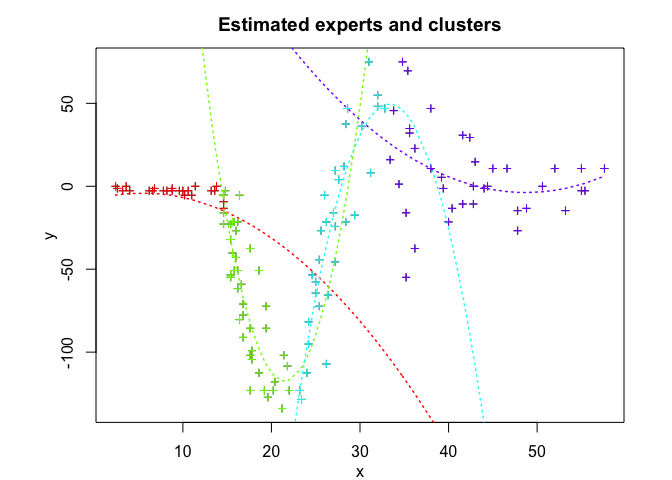

<!-- README.md is generated from README.Rmd. Please edit that file -->
<!-- badges: start -->
<!-- badges: end -->
Overview
========

**STMoE** (Skew-t Mixture-of-Experts) provides a flexible and robust modelling framework for heterogenous data with possibly skewed, heavy-tailed distributions and corrupted by atypical observations. **STMoE** consists of a mixture of *K* skew-t expert regressors network (of degree *p*) gated by a softmax gating network (of degree *q*) and is represented by:

-   The gating network parameters `alpha`'s of the softmax net.
-   The experts network parameters: The location parameters (regression coefficients) `beta`'s, scale parameters `sigma`'s, the skewness parameters `lambda`'s and the degree of freedom parameters `nu`'s. **STMoE** thus generalises mixtures of (normal, skew-normal, t, and skew-t) distributions and mixtures of regressions with these distributions. For example, when *q* = 0, we retrieve mixtures of (skew-t, t-, skew-normal, or normal) regressions, and when both *p* = 0 and *q* = 0, it is a mixture of (skew-t, t-, skew-normal, or normal) distributions. It also reduces to the standard (normal, skew-normal, t, and skew-t) distribution when we only use a single expert (*K* = 1).

Model estimation/learning is performed by a dedicated expectation conditional maximization (ECM) algorithm by maximizing the observed data log-likelihood. We provide simulated examples to illustrate the use of the model in model-based clustering of heterogeneous regression data and in fitting non-linear regression functions.

Installation
============

You can install the development version of StMoE from [GitHub](https://github.com/) with:

``` r
# install.packages("devtools")
devtools::install_github("fchamroukhi/StMoE")
```

To build *vignettes* for examples of usage, type the command below instead:

``` r
# install.packages("devtools")
devtools::install_github("fchamroukhi/StMoE", 
                         build_opts = c("--no-resave-data", "--no-manual"), 
                         build_vignettes = TRUE)
```

Use the following command to display vignettes:

``` r
browseVignettes("StMoE")
```

Usage
=====

``` r
library(StMoE)
```

``` r
# Applicartion to a simulated data set

n <- 500 # Size of the sample
alphak <- matrix(c(0, 8), ncol = 1) # Parameters of the gating network
betak <- matrix(c(0, -2.5, 0, 2.5), ncol = 2) # Regression coefficients of the experts
sigmak <- c(0.5, 0.5) # Standard deviations of the experts
lambdak <- c(3, 5) # Skewness parameters of the experts
nuk <- c(5, 7) # Degrees of freedom of the experts network t densities
x <- seq.int(from = -1, to = 1, length.out = n) # Inputs (predictors)

# Generate sample of size n
sample <- sampleUnivSTMoE(alphak = alphak, betak = betak, sigmak = sigmak, 
                          lambdak = lambdak, nuk = nuk, x = x)
y <- sample$y

K <- 2 # Number of regressors/experts
p <- 1 # Order of the polynomial regression (regressors/experts)
q <- 1 # Order of the logistic regression (gating network)

n_tries <- 1
max_iter <- 1500
threshold <- 1e-5
verbose <- TRUE
verbose_IRLS <- FALSE

stmoe <- emStMoE(X = x, Y = y, K, p, q, n_tries, max_iter, 
                 threshold, verbose, verbose_IRLS)
#> EM - StMoE: Iteration: 1 | log-likelihood: -401.875435809204
#> EM - StMoE: Iteration: 2 | log-likelihood: -337.477110077301
#> EM - StMoE: Iteration: 3 | log-likelihood: -333.615767910121
#> EM - StMoE: Iteration: 4 | log-likelihood: -330.111312841908
#> EM - StMoE: Iteration: 5 | log-likelihood: -326.917627211007
#> EM - StMoE: Iteration: 6 | log-likelihood: -324.051395332145
#> EM - StMoE: Iteration: 7 | log-likelihood: -321.514182102334
#> EM - StMoE: Iteration: 8 | log-likelihood: -319.290135019707
#> EM - StMoE: Iteration: 9 | log-likelihood: -317.345441551248
#> EM - StMoE: Iteration: 10 | log-likelihood: -315.63985448757
#> EM - StMoE: Iteration: 11 | log-likelihood: -314.124403121355
#> EM - StMoE: Iteration: 12 | log-likelihood: -312.764765497604
#> EM - StMoE: Iteration: 13 | log-likelihood: -311.53880220896
#> EM - StMoE: Iteration: 14 | log-likelihood: -310.442219383031
#> EM - StMoE: Iteration: 15 | log-likelihood: -309.461472055389
#> EM - StMoE: Iteration: 16 | log-likelihood: -308.56567749316
#> EM - StMoE: Iteration: 17 | log-likelihood: -307.716979842876
#> EM - StMoE: Iteration: 18 | log-likelihood: -306.878441159492
#> EM - StMoE: Iteration: 19 | log-likelihood: -306.015921604392
#> EM - StMoE: Iteration: 20 | log-likelihood: -305.101893903146
#> EM - StMoE: Iteration: 21 | log-likelihood: -304.119133583187
#> EM - StMoE: Iteration: 22 | log-likelihood: -303.054099432744
#> EM - StMoE: Iteration: 23 | log-likelihood: -301.905764906729
#> EM - StMoE: Iteration: 24 | log-likelihood: -300.685652021046
#> EM - StMoE: Iteration: 25 | log-likelihood: -299.419897252595
#> EM - StMoE: Iteration: 26 | log-likelihood: -298.14232003597
#> EM - StMoE: Iteration: 27 | log-likelihood: -296.891003783925
#> EM - StMoE: Iteration: 28 | log-likelihood: -295.695879770797
#> EM - StMoE: Iteration: 29 | log-likelihood: -294.584368951117
#> EM - StMoE: Iteration: 30 | log-likelihood: -293.571367218735
#> EM - StMoE: Iteration: 31 | log-likelihood: -292.661755632404
#> EM - StMoE: Iteration: 32 | log-likelihood: -291.859412580661
#> EM - StMoE: Iteration: 33 | log-likelihood: -291.157070745516
#> EM - StMoE: Iteration: 34 | log-likelihood: -290.548867853095
#> EM - StMoE: Iteration: 35 | log-likelihood: -290.024516787423
#> EM - StMoE: Iteration: 36 | log-likelihood: -289.579343050895
#> EM - StMoE: Iteration: 37 | log-likelihood: -289.204274620518
#> EM - StMoE: Iteration: 38 | log-likelihood: -288.887304783523
#> EM - StMoE: Iteration: 39 | log-likelihood: -288.619299932711
#> EM - StMoE: Iteration: 40 | log-likelihood: -288.394060854014
#> EM - StMoE: Iteration: 41 | log-likelihood: -288.208138736313
#> EM - StMoE: Iteration: 42 | log-likelihood: -288.057211115457
#> EM - StMoE: Iteration: 43 | log-likelihood: -287.935937429852
#> EM - StMoE: Iteration: 44 | log-likelihood: -287.837686760774
#> EM - StMoE: Iteration: 45 | log-likelihood: -287.758009324673
#> EM - StMoE: Iteration: 46 | log-likelihood: -287.693505506518
#> EM - StMoE: Iteration: 47 | log-likelihood: -287.641479121032
#> EM - StMoE: Iteration: 48 | log-likelihood: -287.601070274841
#> EM - StMoE: Iteration: 49 | log-likelihood: -287.571480227775
#> EM - StMoE: Iteration: 50 | log-likelihood: -287.550936521553
#> EM - StMoE: Iteration: 51 | log-likelihood: -287.537249640429
#> EM - StMoE: Iteration: 52 | log-likelihood: -287.529681605006
#> EM - StMoE: Iteration: 53 | log-likelihood: -287.526784058083
#> EM - StMoE: Iteration: 54 | log-likelihood: -287.527417246547

stmoe$plot()
```


``` r
# Applicartion to a real data set

library(MASS)
data("mcycle")
x <- mcycle$times
y <- mcycle$accel

K <- 4 # Number of regressors/experts
p <- 2 # Order of the polynomial regression (regressors/experts)
q <- 1 # Order of the logistic regression (gating network)

n_tries <- 1
max_iter <- 1500
threshold <- 1e-5
verbose <- TRUE
verbose_IRLS <- FALSE

stmoe <- emStMoE(X = x, Y = y, K, p, q, n_tries, max_iter, 
                 threshold, verbose, verbose_IRLS)
#> EM - StMoE: Iteration: 1 | log-likelihood: -594.443848052501
#> EM - StMoE: Iteration: 2 | log-likelihood: -588.502181624495
#> EM - StMoE: Iteration: 3 | log-likelihood: -584.186980702196
#> EM - StMoE: Iteration: 4 | log-likelihood: -582.404030975252
#> EM - StMoE: Iteration: 5 | log-likelihood: -580.937813111496
#> EM - StMoE: Iteration: 6 | log-likelihood: -579.423652549973
#> EM - StMoE: Iteration: 7 | log-likelihood: -576.622050361883
#> EM - StMoE: Iteration: 8 | log-likelihood: -570.953747711981
#> EM - StMoE: Iteration: 9 | log-likelihood: -565.635572832749
#> EM - StMoE: Iteration: 10 | log-likelihood: -562.282158040806
#> EM - StMoE: Iteration: 11 | log-likelihood: -560.730917766499
#> EM - StMoE: Iteration: 12 | log-likelihood: -559.942176077191
#> EM - StMoE: Iteration: 13 | log-likelihood: -559.405646251887
#> EM - StMoE: Iteration: 14 | log-likelihood: -558.951217277183
#> EM - StMoE: Iteration: 15 | log-likelihood: -558.507765685732
#> EM - StMoE: Iteration: 16 | log-likelihood: -558.029259677093
#> EM - StMoE: Iteration: 17 | log-likelihood: -557.483925261304
#> EM - StMoE: Iteration: 18 | log-likelihood: -556.885711396855
#> EM - StMoE: Iteration: 19 | log-likelihood: -556.335191609929
#> EM - StMoE: Iteration: 20 | log-likelihood: -555.93437847599
#> EM - StMoE: Iteration: 21 | log-likelihood: -555.69829587786
#> EM - StMoE: Iteration: 22 | log-likelihood: -555.581028161933
#> EM - StMoE: Iteration: 23 | log-likelihood: -555.528856112894
#> EM - StMoE: Iteration: 24 | log-likelihood: -555.508227478769
#> EM - StMoE: Iteration: 25 | log-likelihood: -555.504406448179

stmoe$plot()
```


