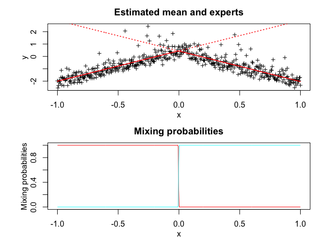
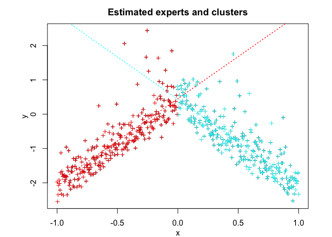

<!-- README.md is generated from README.Rmd. Please edit that file -->

<!-- badges: start -->

<!-- badges: end -->

# Overview

User-friendly and flexible algorithm modelling, sampling, inference, and
clustering heterogeneous data with the Skew-t Mixture-of-Experts (StMoE)
model.

# Installation

You can install the development version of StMoE from
[GitHub](https://github.com/) with:

``` r
# install.packages("devtools")
devtools::install_github("fchamroukhi/StMoE")
```

To build *vignettes* for examples of usage, type the command below
instead:

``` r
# install.packages("devtools")
devtools::install_github("fchamroukhi/StMoE", 
                         build_opts = c("--no-resave-data", "--no-manual"), 
                         build_vignettes = TRUE)
```

Use the following command to display vignettes:

``` r
browseVignettes("StMoE")
```

# Usage

``` r
library(StMoE)
```

``` r
n <- 1000 # Size of the sample
K <- 2 # Number of regressors/experts
p <- 1 # Order of the polynomial regression (regressors/experts)
q <- 1 # Order of the logistic regression (gating network)

alphak <- matrix(c(0, 8), ncol = K - 1) # Parameters of the gating network
betak <- matrix(c(0, -1, 0, 1), ncol = K) # Regression coefficients of the experts
sigmak <- c(0.1, 0.1) # Standard deviations of the experts
lambdak <- c(3, 5) # Skewness parameters of the experts
nuk <- c(5, 7) # Degrees of freedom of the experts network t densities
x <- seq.int(from = -1, to = 1, length.out = n) # Inputs (predictors)

# Generate sample of size n
sample <- sampleUnivSTMoE(alphak = alphak, betak = betak, sigmak = sigmak, 
                          lambdak = lambdak, nuk = nuk, x = x)

n_tries <- 1
max_iter <- 1500
threshold <- 1e-5
verbose <- TRUE
verbose_IRLS <- FALSE

stmoe <- emStMoE(x, matrix(sample$y), K, p, q, n_tries, max_iter, 
                 threshold, verbose, verbose_IRLS)
#> EM - StMoE: Iteration: 1 | log-likelihood: -501.35369496197
#> EM - StMoE: Iteration: 2 | log-likelihood: -432.97801970007
#> EM - StMoE: Iteration: 3 | log-likelihood: -404.504670313195
#> EM - StMoE: Iteration: 4 | log-likelihood: -388.169953088582
#> EM - StMoE: Iteration: 5 | log-likelihood: -376.711627629134
#> EM - StMoE: Iteration: 6 | log-likelihood: -361.175361628645
#> EM - StMoE: Iteration: 7 | log-likelihood: -327.136618172042
#> EM - StMoE: Iteration: 8 | log-likelihood: -237.515480144915
#> EM - StMoE: Iteration: 9 | log-likelihood: -63.3910877901628
#> EM - StMoE: Iteration: 10 | log-likelihood: 182.609615324285
#> EM - StMoE: Iteration: 11 | log-likelihood: 462.931191249288
#> EM - StMoE: Iteration: 12 | log-likelihood: 678.150758570044
#> EM - StMoE: Iteration: 13 | log-likelihood: 812.685269765255
#> EM - StMoE: Iteration: 14 | log-likelihood: 866.999481077201
#> EM - StMoE: Iteration: 15 | log-likelihood: 917.53064986956
#> EM - StMoE: Iteration: 16 | log-likelihood: 942.855884675266
#> EM - StMoE: Iteration: 17 | log-likelihood: 963.540386193921
#> EM - StMoE: Iteration: 18 | log-likelihood: 976.131946763379
#> EM - StMoE: Iteration: 19 | log-likelihood: 984.93267114796
#> EM - StMoE: Iteration: 20 | log-likelihood: 991.140825559439
#> EM - StMoE: Iteration: 21 | log-likelihood: 995.786647503126
#> EM - StMoE: Iteration: 22 | log-likelihood: 999.364829464893
#> EM - StMoE: Iteration: 23 | log-likelihood: 1002.18724292243
#> EM - StMoE: Iteration: 24 | log-likelihood: 1004.45542114402
#> EM - StMoE: Iteration: 25 | log-likelihood: 1006.30941442827
#> EM - StMoE: Iteration: 26 | log-likelihood: 1007.85036050368
#> EM - StMoE: Iteration: 27 | log-likelihood: 1009.14866508065
#> EM - StMoE: Iteration: 28 | log-likelihood: 1010.25203390793
#> EM - StMoE: Iteration: 29 | log-likelihood: 1011.19922496803
#> EM - StMoE: Iteration: 30 | log-likelihood: 1012.02000052503
#> EM - StMoE: Iteration: 31 | log-likelihood: 1012.73730675077
#> EM - StMoE: Iteration: 32 | log-likelihood: 1013.36868063941
#> EM - StMoE: Iteration: 33 | log-likelihood: 1013.92893825357
#> EM - StMoE: Iteration: 34 | log-likelihood: 1014.42792775746
#> EM - StMoE: Iteration: 35 | log-likelihood: 1014.87436254404
#> EM - StMoE: Iteration: 36 | log-likelihood: 1015.27541287814
#> EM - StMoE: Iteration: 37 | log-likelihood: 1015.63751201515
#> EM - StMoE: Iteration: 38 | log-likelihood: 1015.96596133898
#> EM - StMoE: Iteration: 39 | log-likelihood: 1016.26496552437
#> EM - StMoE: Iteration: 40 | log-likelihood: 1016.53790524474
#> EM - StMoE: Iteration: 41 | log-likelihood: 1016.78816064144
#> EM - StMoE: Iteration: 42 | log-likelihood: 1017.01810571898
#> EM - StMoE: Iteration: 43 | log-likelihood: 1017.22997223251
#> EM - StMoE: Iteration: 44 | log-likelihood: 1017.42635189357
#> EM - StMoE: Iteration: 45 | log-likelihood: 1017.6080930894
#> EM - StMoE: Iteration: 46 | log-likelihood: 1017.77658522531
#> EM - StMoE: Iteration: 47 | log-likelihood: 1017.93289148536
#> EM - StMoE: Iteration: 48 | log-likelihood: 1018.0784372786
#> EM - StMoE: Iteration: 49 | log-likelihood: 1018.21416960401
#> EM - StMoE: Iteration: 50 | log-likelihood: 1018.34091230033
#> EM - StMoE: Iteration: 51 | log-likelihood: 1018.45940147239
#> EM - StMoE: Iteration: 52 | log-likelihood: 1018.57030574961
#> EM - StMoE: Iteration: 53 | log-likelihood: 1018.67427002414
#> EM - StMoE: Iteration: 54 | log-likelihood: 1018.77169961211
#> EM - StMoE: Iteration: 55 | log-likelihood: 1018.86314832291
#> EM - StMoE: Iteration: 56 | log-likelihood: 1018.94905967055
#> EM - StMoE: Iteration: 57 | log-likelihood: 1019.02986297059
#> EM - StMoE: Iteration: 58 | log-likelihood: 1019.10588955701
#> EM - StMoE: Iteration: 59 | log-likelihood: 1019.17746549487
#> EM - StMoE: Iteration: 60 | log-likelihood: 1019.24489823961
#> EM - StMoE: Iteration: 61 | log-likelihood: 1019.30847102145
#> EM - StMoE: Iteration: 62 | log-likelihood: 1019.36844485585
#> EM - StMoE: Iteration: 63 | log-likelihood: 1019.42506365806
#> EM - StMoE: Iteration: 64 | log-likelihood: 1019.47854309594
#> EM - StMoE: Iteration: 65 | log-likelihood: 1019.5290878523
#> EM - StMoE: Iteration: 66 | log-likelihood: 1019.57688749204
#> EM - StMoE: Iteration: 67 | log-likelihood: 1019.62211508892
#> EM - StMoE: Iteration: 68 | log-likelihood: 1019.66493071126
#> EM - StMoE: Iteration: 69 | log-likelihood: 1019.7054801207
#> EM - StMoE: Iteration: 70 | log-likelihood: 1019.74386891979
#> EM - StMoE: Iteration: 71 | log-likelihood: 1019.78023658666
#> EM - StMoE: Iteration: 72 | log-likelihood: 1019.81471887822
#> EM - StMoE: Iteration: 73 | log-likelihood: 1019.84743629581
#> EM - StMoE: Iteration: 74 | log-likelihood: 1019.87849614604
#> EM - StMoE: Iteration: 75 | log-likelihood: 1019.90799596518
#> EM - StMoE: Iteration: 76 | log-likelihood: 1019.93601415945
#> EM - StMoE: Iteration: 77 | log-likelihood: 1019.96263890574
#> EM - StMoE: Iteration: 78 | log-likelihood: 1019.98815201715
#> EM - StMoE: Iteration: 79 | log-likelihood: 1020.01242096632
#> EM - StMoE: Iteration: 80 | log-likelihood: 1020.0355071953
#> EM - StMoE: Iteration: 81 | log-likelihood: 1020.05748024275
#> EM - StMoE: Iteration: 82 | log-likelihood: 1020.07840031497
#> EM - StMoE: Iteration: 83 | log-likelihood: 1020.09832515852
#> EM - StMoE: Iteration: 84 | log-likelihood: 1020.11730995811
#> EM - StMoE: Iteration: 85 | log-likelihood: 1020.13540681172
#> EM - StMoE: Iteration: 86 | log-likelihood: 1020.15267595403
#> EM - StMoE: Iteration: 87 | log-likelihood: 1020.16916363736
#> EM - StMoE: Iteration: 88 | log-likelihood: 1020.18490300051
#> EM - StMoE: Iteration: 89 | log-likelihood: 1020.1999270607
#> EM - StMoE: Iteration: 90 | log-likelihood: 1020.21428690718
#> EM - StMoE: Iteration: 91 | log-likelihood: 1020.22798311969
#> EM - StMoE: Iteration: 92 | log-likelihood: 1020.24109009842
#> EM - StMoE: Iteration: 93 | log-likelihood: 1020.25364326617
#> EM - StMoE: Iteration: 94 | log-likelihood: 1020.2656707411
#> EM - StMoE: Iteration: 95 | log-likelihood: 1020.2772029202
#> EM - StMoE: Iteration: 96 | log-likelihood: 1020.28826738931
#> EM - StMoE: Iteration: 97 | log-likelihood: 1020.29888930197
#> EM - StMoE: Iteration: 98 | log-likelihood: 1020.30909191208

stmoe$plot()
```


