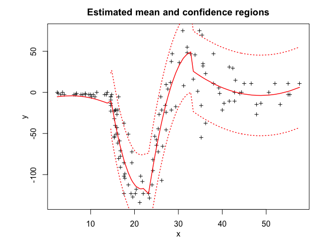

<!-- README.md is generated from README.Rmd. Please edit that file -->

<!-- badges: start -->

<!-- badges: end -->

# Overview

**StMoE** (Skew-t Mixture-of-Experts) provides a flexible and robust
modelling framework for heterogenous data with possibly skewed,
heavy-tailed distributions and corrupted by atypical observations.
**StMoE** consists of a mixture of *K* skew-t expert regressors network
(of degree *p*) gated by a softmax gating network (of degree *q*) and is
represented by:

  - The gating network parameters `alpha`’s of the softmax net.
  - The experts network parameters: The location parameters (regression
    coefficients) `beta`’s, scale parameters `sigma`’s, the skewness
    parameters `lambda`’s and the degree of freedom parameters `nu`’s.
    **StMoE** thus generalises mixtures of (normal, skew-normal, t, and
    skew-t) distributions and mixtures of regressions with these
    distributions. For example, when \(q=0\), we retrieve mixtures of
    (skew-t, t-, skew-normal, or normal) regressions, and when both
    \(p=0\) and \(q=0\), it is a mixture of (skew-t, t-, skew-normal, or
    normal) distributions. It also reduces to the standard (normal,
    skew-normal, t, and skew-t) distribution when we only use a single
    expert (\(K=1\)).

Model estimation/learning is performed by a dedicated expectation
conditional maximization (ECM) algorithm by maximizing the observed data
log-likelihood. We provide simulated examples to illustrate the use of
the model in model-based clustering of heterogeneous regression data and
in fitting non-linear regression functions.

# Installation

You can install the development version of StMoE from
[GitHub](https://github.com/) with:

``` r
# install.packages("devtools")
devtools::install_github("fchamroukhi/StMoE")
```

To build *vignettes* for examples of usage, type the command below
instead:

``` r
# install.packages("devtools")
devtools::install_github("fchamroukhi/StMoE", 
                         build_opts = c("--no-resave-data", "--no-manual"), 
                         build_vignettes = TRUE)
```

Use the following command to display vignettes:

``` r
browseVignettes("StMoE")
```

# Usage

``` r
library(StMoE)
```

``` r
# Applicartion to a simulated data set

n <- 500 # Size of the sample
alphak <- matrix(c(0, 8), ncol = 1) # Parameters of the gating network
betak <- matrix(c(0, -2.5, 0, 2.5), ncol = 2) # Regression coefficients of the experts
sigmak <- c(0.5, 0.5) # Standard deviations of the experts
lambdak <- c(3, 5) # Skewness parameters of the experts
nuk <- c(5, 7) # Degrees of freedom of the experts network t densities
x <- seq.int(from = -1, to = 1, length.out = n) # Inputs (predictors)

# Generate sample of size n
sample <- sampleUnivStMoE(alphak = alphak, betak = betak, 
                          sigmak = sigmak, lambdak = lambdak, 
                          nuk = nuk, x = x)
y <- sample$y

K <- 2 # Number of regressors/experts
p <- 1 # Order of the polynomial regression (regressors/experts)
q <- 1 # Order of the logistic regression (gating network)

stmoe <- emStMoE(X = x, Y = y, K = K, p = p, q = q, verbose = TRUE)
#> EM - StMoE: Iteration: 1 | log-likelihood: -313.677036627204
#> EM - StMoE: Iteration: 2 | log-likelihood: -304.743366974552
#> EM - StMoE: Iteration: 3 | log-likelihood: -303.241083338317
#> EM - StMoE: Iteration: 4 | log-likelihood: -302.398166051641
#> EM - StMoE: Iteration: 5 | log-likelihood: -301.932198441693
#> EM - StMoE: Iteration: 6 | log-likelihood: -301.652858521563
#> EM - StMoE: Iteration: 7 | log-likelihood: -301.463184106081
#> EM - StMoE: Iteration: 8 | log-likelihood: -301.316302040905
#> EM - StMoE: Iteration: 9 | log-likelihood: -301.189780597304
#> EM - StMoE: Iteration: 10 | log-likelihood: -301.071905070965
#> EM - StMoE: Iteration: 11 | log-likelihood: -300.955853288454
#> EM - StMoE: Iteration: 12 | log-likelihood: -300.836643184448
#> EM - StMoE: Iteration: 13 | log-likelihood: -300.709435818877
#> EM - StMoE: Iteration: 14 | log-likelihood: -300.569024504568
#> EM - StMoE: Iteration: 15 | log-likelihood: -300.408661189373
#> EM - StMoE: Iteration: 16 | log-likelihood: -300.218849079537
#> EM - StMoE: Iteration: 17 | log-likelihood: -299.985627697807
#> EM - StMoE: Iteration: 18 | log-likelihood: -299.687683044761
#> EM - StMoE: Iteration: 19 | log-likelihood: -299.292130029605
#> EM - StMoE: Iteration: 20 | log-likelihood: -298.748230172636
#> EM - StMoE: Iteration: 21 | log-likelihood: -297.980506294133
#> EM - StMoE: Iteration: 22 | log-likelihood: -296.884602134782
#> EM - StMoE: Iteration: 23 | log-likelihood: -295.336508276659
#> EM - StMoE: Iteration: 24 | log-likelihood: -293.246932579091
#> EM - StMoE: Iteration: 25 | log-likelihood: -290.625743944283
#> EM - StMoE: Iteration: 26 | log-likelihood: -287.611320408979
#> EM - StMoE: Iteration: 27 | log-likelihood: -284.41975156752
#> EM - StMoE: Iteration: 28 | log-likelihood: -281.270955252439
#> EM - StMoE: Iteration: 29 | log-likelihood: -278.324697139084
#> EM - StMoE: Iteration: 30 | log-likelihood: -275.663312584699
#> EM - StMoE: Iteration: 31 | log-likelihood: -273.312782249227
#> EM - StMoE: Iteration: 32 | log-likelihood: -271.247799566446
#> EM - StMoE: Iteration: 33 | log-likelihood: -269.423673029226
#> EM - StMoE: Iteration: 34 | log-likelihood: -267.775445509454
#> EM - StMoE: Iteration: 35 | log-likelihood: -266.219396053972
#> EM - StMoE: Iteration: 36 | log-likelihood: -264.661604129841
#> EM - StMoE: Iteration: 37 | log-likelihood: -263.009700555625
#> EM - StMoE: Iteration: 38 | log-likelihood: -261.196661029592
#> EM - StMoE: Iteration: 39 | log-likelihood: -259.203601716413
#> EM - StMoE: Iteration: 40 | log-likelihood: -257.071233696119
#> EM - StMoE: Iteration: 41 | log-likelihood: -254.879737370432
#> EM - StMoE: Iteration: 42 | log-likelihood: -252.721037210609
#> EM - StMoE: Iteration: 43 | log-likelihood: -250.679002209029
#> EM - StMoE: Iteration: 44 | log-likelihood: -248.81377156785
#> EM - StMoE: Iteration: 45 | log-likelihood: -247.155815597416
#> EM - StMoE: Iteration: 46 | log-likelihood: -245.714964975576
#> EM - StMoE: Iteration: 47 | log-likelihood: -244.481277797412
#> EM - StMoE: Iteration: 48 | log-likelihood: -243.436323002969
#> EM - StMoE: Iteration: 49 | log-likelihood: -242.555006506039
#> EM - StMoE: Iteration: 50 | log-likelihood: -241.819072823087
#> EM - StMoE: Iteration: 51 | log-likelihood: -241.207701943778
#> EM - StMoE: Iteration: 52 | log-likelihood: -240.698844726696
#> EM - StMoE: Iteration: 53 | log-likelihood: -240.275684577036
#> EM - StMoE: Iteration: 54 | log-likelihood: -239.92769041402
#> EM - StMoE: Iteration: 55 | log-likelihood: -239.642524941545
#> EM - StMoE: Iteration: 56 | log-likelihood: -239.407925889792
#> EM - StMoE: Iteration: 57 | log-likelihood: -239.214894050006
#> EM - StMoE: Iteration: 58 | log-likelihood: -239.056455654766
#> EM - StMoE: Iteration: 59 | log-likelihood: -238.927514839681
#> EM - StMoE: Iteration: 60 | log-likelihood: -238.824016678719
#> EM - StMoE: Iteration: 61 | log-likelihood: -238.741434320082
#> EM - StMoE: Iteration: 62 | log-likelihood: -238.676164882533
#> EM - StMoE: Iteration: 63 | log-likelihood: -238.625284613346
#> EM - StMoE: Iteration: 64 | log-likelihood: -238.586424632453
#> EM - StMoE: Iteration: 65 | log-likelihood: -238.557414897791
#> EM - StMoE: Iteration: 66 | log-likelihood: -238.536735631366
#> EM - StMoE: Iteration: 67 | log-likelihood: -238.524181304992
#> EM - StMoE: Iteration: 68 | log-likelihood: -238.518114601757
#> EM - StMoE: Iteration: 69 | log-likelihood: -238.517231398422
#> EM - StMoE: Iteration: 70 | log-likelihood: -238.520493627843
#> EM - StMoE: Iteration: 71 | log-likelihood: -238.52706429015
#> EM - StMoE: Iteration: 72 | log-likelihood: -238.536260790101
#> EM - StMoE: Iteration: 73 | log-likelihood: -238.54752329793
#> EM - StMoE: Iteration: 74 | log-likelihood: -238.560398935216
#> EM - StMoE: Iteration: 75 | log-likelihood: -238.574532328275
#> EM - StMoE: Iteration: 76 | log-likelihood: -238.589477015097
#> EM - StMoE: Iteration: 77 | log-likelihood: -238.605088066555
#> EM - StMoE: Iteration: 78 | log-likelihood: -238.621134173219
#> EM - StMoE: Iteration: 79 | log-likelihood: -238.637426566943
#> EM - StMoE: Iteration: 80 | log-likelihood: -238.653782793141
#> EM - StMoE: Iteration: 81 | log-likelihood: -238.670141096202
#> EM - StMoE: Iteration: 82 | log-likelihood: -238.686345061787
#> EM - StMoE: Iteration: 83 | log-likelihood: -238.702364058959
#> EM - StMoE: Iteration: 84 | log-likelihood: -238.718048958972
#> EM - StMoE: Iteration: 85 | log-likelihood: -238.733817065732
#> EM - StMoE: Iteration: 86 | log-likelihood: -238.749432901382
#> EM - StMoE: Iteration: 87 | log-likelihood: -238.764802587963
#> EM - StMoE: Iteration: 88 | log-likelihood: -238.779855505803
#> EM - StMoE: Iteration: 89 | log-likelihood: -238.79453920768
#> EM - StMoE: Iteration: 90 | log-likelihood: -238.808815635146
#> EM - StMoE: Iteration: 91 | log-likelihood: -238.822658179524
#> EM - StMoE: Iteration: 92 | log-likelihood: -238.836049346667
#> EM - StMoE: Iteration: 93 | log-likelihood: -238.848978046385
#> EM - StMoE: Iteration: 94 | log-likelihood: -238.86144499411
#> EM - StMoE: Iteration: 95 | log-likelihood: -238.873439717377
#> EM - StMoE: Iteration: 96 | log-likelihood: -238.884968650432
#> EM - StMoE: Iteration: 97 | log-likelihood: -238.896036051151
#> EM - StMoE: Iteration: 98 | log-likelihood: -238.906648555212
#> EM - StMoE: Iteration: 99 | log-likelihood: -238.916880446633
#> EM - StMoE: Iteration: 100 | log-likelihood: -238.926655910993
#> EM - StMoE: Iteration: 101 | log-likelihood: -238.935997808103
#> EM - StMoE: Iteration: 102 | log-likelihood: -238.944937477143
#> EM - StMoE: Iteration: 103 | log-likelihood: -238.953573696157
#> EM - StMoE: Iteration: 104 | log-likelihood: -238.961810452354
#> EM - StMoE: Iteration: 105 | log-likelihood: -238.969666380971
#> EM - StMoE: Iteration: 106 | log-likelihood: -238.977158583039
#> EM - StMoE: Iteration: 107 | log-likelihood: -238.984303049676
#> EM - StMoE: Iteration: 108 | log-likelihood: -238.991114897365
#> EM - StMoE: Iteration: 109 | log-likelihood: -238.997608506568
#> EM - StMoE: Iteration: 110 | log-likelihood: -239.003797609158
#> EM - StMoE: Iteration: 111 | log-likelihood: -239.009695347534
#> EM - StMoE: Iteration: 112 | log-likelihood: -239.015314317262
#> EM - StMoE: Iteration: 113 | log-likelihood: -239.020666599624
#> EM - StMoE: Iteration: 114 | log-likelihood: -239.025763787696
#> EM - StMoE: Iteration: 115 | log-likelihood: -239.030617008102
#> EM - StMoE: Iteration: 116 | log-likelihood: -239.035236939822
#> EM - StMoE: Iteration: 117 | log-likelihood: -239.039633830913
#> EM - StMoE: Iteration: 118 | log-likelihood: -239.043817513777
#> EM - StMoE: Iteration: 119 | log-likelihood: -239.047797419374
#> EM - StMoE: Iteration: 120 | log-likelihood: -239.051582590672
#> EM - StMoE: Iteration: 121 | log-likelihood: -239.055181695541
#> EM - StMoE: Iteration: 122 | log-likelihood: -239.058603039229
#> EM - StMoE: Iteration: 123 | log-likelihood: -239.061854576498
#> EM - StMoE: Iteration: 124 | log-likelihood: -239.064943923499
#> EM - StMoE: Iteration: 125 | log-likelihood: -239.067878369414
#> EM - StMoE: Iteration: 126 | log-likelihood: -239.070664887875
#> EM - StMoE: Iteration: 127 | log-likelihood: -239.073310148188
#> EM - StMoE: Iteration: 128 | log-likelihood: -239.075820526336
#> EM - StMoE: Iteration: 129 | log-likelihood: -239.078202458469
#> EM - StMoE: Iteration: 130 | log-likelihood: -239.08046194937
#> EM - StMoE: Iteration: 131 | log-likelihood: -239.082604373028
#> EM - StMoE: Iteration: 132 | log-likelihood: -239.084634900991
#> EM - StMoE: Iteration: 133 | log-likelihood: -239.086558499205
#> EM - StMoE: Iteration: 134 | log-likelihood: -239.088379928592
#> EM - StMoE: Iteration: 135 | log-likelihood: -239.090103747864
#> EM - StMoE: Iteration: 136 | log-likelihood: -239.091734317747
#> EM - StMoE: Iteration: 137 | log-likelihood: -239.093275806105
#> EM - StMoE: Iteration: 138 | log-likelihood: -239.094732193658
#> EM - StMoE: Iteration: 139 | log-likelihood: -239.096107280062
#> EM - StMoE: Iteration: 140 | log-likelihood: -239.097404690216
#> EM - StMoE: Iteration: 141 | log-likelihood: -239.098627880668
#> EM - StMoE: Iteration: 142 | log-likelihood: -239.099780146058
#> EM - StMoE: Iteration: 143 | log-likelihood: -239.100864625507
#> EM - StMoE: Iteration: 144 | log-likelihood: -239.101884308933
#> EM - StMoE: Iteration: 145 | log-likelihood: -239.102842043246
#> EM - StMoE: Iteration: 146 | log-likelihood: -239.103740538392
#> EM - StMoE: Iteration: 147 | log-likelihood: -239.104582373239
#> EM - StMoE: Iteration: 148 | log-likelihood: -239.105370001276
#> EM - StMoE: Iteration: 149 | log-likelihood: -239.106105756137
#> EM - StMoE: Iteration: 150 | log-likelihood: -239.106791856921
#> EM - StMoE: Iteration: 151 | log-likelihood: -239.107430413325
#> EM - StMoE: Iteration: 152 | log-likelihood: -239.108023430572
#> EM - StMoE: Iteration: 153 | log-likelihood: -239.108572814152
#> EM - StMoE: Iteration: 154 | log-likelihood: -239.109080374363
#> EM - StMoE: Iteration: 155 | log-likelihood: -239.109547830665
#> EM - StMoE: Iteration: 156 | log-likelihood: -239.109976815845
#> EM - StMoE: Iteration: 157 | log-likelihood: -239.110368879998
#> EM - StMoE: Iteration: 158 | log-likelihood: -239.110725494333
#> EM - StMoE: Iteration: 159 | log-likelihood: -239.111048054801
#> EM - StMoE: Iteration: 160 | log-likelihood: -239.111337885551
#> EM - StMoE: Iteration: 161 | log-likelihood: -239.111596242234
#> EM - StMoE: Iteration: 162 | log-likelihood: -239.11182431513

stmoe$summary()
#> ------------------------------------------
#> Fitted Skew t Mixture-of-Experts model
#> ------------------------------------------
#> 
#> StMoE model with K = 2 experts:
#> 
#>  log-likelihood df       AIC       BIC       ICL
#>       -239.1118 12 -251.1118 -276.3995 -276.7281
#> 
#> Clustering table (Number of observations in each expert):
#> 
#>   1   2 
#> 249 251 
#> 
#> Regression coefficients:
#> 
#>     Beta(k = 1) Beta(k = 2)
#> 1   -0.08583445   -0.139524
#> X^1  2.45592534   -2.465143
#> 
#> Variances:
#> 
#>  Sigma2(k = 1) Sigma2(k = 2)
#>      0.4514526     0.5186537

stmoe$plot()
```


``` r
# Applicartion to a real data set

library(MASS)
data("mcycle")
x <- mcycle$times
y <- mcycle$accel

K <- 4 # Number of regressors/experts
p <- 2 # Order of the polynomial regression (regressors/experts)
q <- 1 # Order of the logistic regression (gating network)

stmoe <- emStMoE(X = x, Y = y, K = K, p = p, q = q, verbose = TRUE)
#> EM - StMoE: Iteration: 1 | log-likelihood: -599.121493144955
#> EM - StMoE: Iteration: 2 | log-likelihood: -589.783485660297
#> EM - StMoE: Iteration: 3 | log-likelihood: -587.281458998556
#> EM - StMoE: Iteration: 4 | log-likelihood: -585.537728626033
#> EM - StMoE: Iteration: 5 | log-likelihood: -584.033642364304
#> EM - StMoE: Iteration: 6 | log-likelihood: -582.48206640408
#> EM - StMoE: Iteration: 7 | log-likelihood: -580.356388983666
#> EM - StMoE: Iteration: 8 | log-likelihood: -577.103667178712
#> EM - StMoE: Iteration: 9 | log-likelihood: -573.388628316526
#> EM - StMoE: Iteration: 10 | log-likelihood: -570.250947412588
#> EM - StMoE: Iteration: 11 | log-likelihood: -568.1468459503
#> EM - StMoE: Iteration: 12 | log-likelihood: -566.756839289315
#> EM - StMoE: Iteration: 13 | log-likelihood: -565.707664444501
#> EM - StMoE: Iteration: 14 | log-likelihood: -564.903164719276
#> EM - StMoE: Iteration: 15 | log-likelihood: -564.355421686011
#> EM - StMoE: Iteration: 16 | log-likelihood: -563.982704775745
#> EM - StMoE: Iteration: 17 | log-likelihood: -563.701762917998
#> EM - StMoE: Iteration: 18 | log-likelihood: -563.474918508736
#> EM - StMoE: Iteration: 19 | log-likelihood: -563.285736927829
#> EM - StMoE: Iteration: 20 | log-likelihood: -563.124474080127
#> EM - StMoE: Iteration: 21 | log-likelihood: -562.984492716253
#> EM - StMoE: Iteration: 22 | log-likelihood: -562.860312916241
#> EM - StMoE: Iteration: 23 | log-likelihood: -562.745326816856
#> EM - StMoE: Iteration: 24 | log-likelihood: -562.634346131802
#> EM - StMoE: Iteration: 25 | log-likelihood: -562.523140831912
#> EM - StMoE: Iteration: 26 | log-likelihood: -562.409374974974
#> EM - StMoE: Iteration: 27 | log-likelihood: -562.293968848831
#> EM - StMoE: Iteration: 28 | log-likelihood: -562.180204930482
#> EM - StMoE: Iteration: 29 | log-likelihood: -562.073308866734
#> EM - StMoE: Iteration: 30 | log-likelihood: -561.977618071065
#> EM - StMoE: Iteration: 31 | log-likelihood: -561.894602082582
#> EM - StMoE: Iteration: 32 | log-likelihood: -561.822988559687
#> EM - StMoE: Iteration: 33 | log-likelihood: -561.760110715741
#> EM - StMoE: Iteration: 34 | log-likelihood: -561.703090102545
#> EM - StMoE: Iteration: 35 | log-likelihood: -561.649350280492
#> EM - StMoE: Iteration: 36 | log-likelihood: -561.596642448868
#> EM - StMoE: Iteration: 37 | log-likelihood: -561.542875793715
#> EM - StMoE: Iteration: 38 | log-likelihood: -561.485927183216
#> EM - StMoE: Iteration: 39 | log-likelihood: -561.42350207246
#> EM - StMoE: Iteration: 40 | log-likelihood: -561.353081961213
#> EM - StMoE: Iteration: 41 | log-likelihood: -561.271914236868
#> EM - StMoE: Iteration: 42 | log-likelihood: -561.177469138301
#> EM - StMoE: Iteration: 43 | log-likelihood: -561.067409426494
#> EM - StMoE: Iteration: 44 | log-likelihood: -560.940531490499
#> EM - StMoE: Iteration: 45 | log-likelihood: -560.79682574961
#> EM - StMoE: Iteration: 46 | log-likelihood: -560.637608710602
#> EM - StMoE: Iteration: 47 | log-likelihood: -560.46533706309
#> EM - StMoE: Iteration: 48 | log-likelihood: -560.28312294722
#> EM - StMoE: Iteration: 49 | log-likelihood: -560.094098464698
#> EM - StMoE: Iteration: 50 | log-likelihood: -559.900936114262
#> EM - StMoE: Iteration: 51 | log-likelihood: -559.705756684645
#> EM - StMoE: Iteration: 52 | log-likelihood: -559.510316870265
#> EM - StMoE: Iteration: 53 | log-likelihood: -559.316052355296
#> EM - StMoE: Iteration: 54 | log-likelihood: -559.124077559994
#> EM - StMoE: Iteration: 55 | log-likelihood: -558.936177271465
#> EM - StMoE: Iteration: 56 | log-likelihood: -558.752949143058
#> EM - StMoE: Iteration: 57 | log-likelihood: -558.574904312857
#> EM - StMoE: Iteration: 58 | log-likelihood: -558.402775228661
#> EM - StMoE: Iteration: 59 | log-likelihood: -558.236888905403
#> EM - StMoE: Iteration: 60 | log-likelihood: -558.076314144843
#> EM - StMoE: Iteration: 61 | log-likelihood: -557.921300594628
#> EM - StMoE: Iteration: 62 | log-likelihood: -557.77215607402
#> EM - StMoE: Iteration: 63 | log-likelihood: -557.629067599982
#> EM - StMoE: Iteration: 64 | log-likelihood: -557.492212865795
#> EM - StMoE: Iteration: 65 | log-likelihood: -557.361761874876
#> EM - StMoE: Iteration: 66 | log-likelihood: -557.237779330751
#> EM - StMoE: Iteration: 67 | log-likelihood: -557.120262584187
#> EM - StMoE: Iteration: 68 | log-likelihood: -557.00913557489
#> EM - StMoE: Iteration: 69 | log-likelihood: -556.904254848876
#> EM - StMoE: Iteration: 70 | log-likelihood: -556.805419720514
#> EM - StMoE: Iteration: 71 | log-likelihood: -556.712371882652
#> EM - StMoE: Iteration: 72 | log-likelihood: -556.624856381048
#> EM - StMoE: Iteration: 73 | log-likelihood: -556.542552833369
#> EM - StMoE: Iteration: 74 | log-likelihood: -556.464682613315
#> EM - StMoE: Iteration: 75 | log-likelihood: -556.390755293815
#> EM - StMoE: Iteration: 76 | log-likelihood: -556.320626798225
#> EM - StMoE: Iteration: 77 | log-likelihood: -556.254113406395
#> EM - StMoE: Iteration: 78 | log-likelihood: -556.191020246044
#> EM - StMoE: Iteration: 79 | log-likelihood: -556.131147705407
#> EM - StMoE: Iteration: 80 | log-likelihood: -556.074298475361
#> EM - StMoE: Iteration: 81 | log-likelihood: -556.020271806441
#> EM - StMoE: Iteration: 82 | log-likelihood: -555.968889498304
#> EM - StMoE: Iteration: 83 | log-likelihood: -555.919972103113
#> EM - StMoE: Iteration: 84 | log-likelihood: -555.873353742224
#> EM - StMoE: Iteration: 85 | log-likelihood: -555.828906973278
#> EM - StMoE: Iteration: 86 | log-likelihood: -555.786452165936
#> EM - StMoE: Iteration: 87 | log-likelihood: -555.745868210168
#> EM - StMoE: Iteration: 88 | log-likelihood: -555.70702926834
#> EM - StMoE: Iteration: 89 | log-likelihood: -555.669823243853
#> EM - StMoE: Iteration: 90 | log-likelihood: -555.634146938562
#> EM - StMoE: Iteration: 91 | log-likelihood: -555.599905442097
#> EM - StMoE: Iteration: 92 | log-likelihood: -555.567004052774
#> EM - StMoE: Iteration: 93 | log-likelihood: -555.535369882082
#> EM - StMoE: Iteration: 94 | log-likelihood: -555.504897328794
#> EM - StMoE: Iteration: 95 | log-likelihood: -555.475551164801
#> EM - StMoE: Iteration: 96 | log-likelihood: -555.447263285113
#> EM - StMoE: Iteration: 97 | log-likelihood: -555.419973982546
#> EM - StMoE: Iteration: 98 | log-likelihood: -555.39362822833
#> EM - StMoE: Iteration: 99 | log-likelihood: -555.368175222301
#> EM - StMoE: Iteration: 100 | log-likelihood: -555.343568057693
#> EM - StMoE: Iteration: 101 | log-likelihood: -555.319764038456
#> EM - StMoE: Iteration: 102 | log-likelihood: -555.296720916995
#> EM - StMoE: Iteration: 103 | log-likelihood: -555.274403537149
#> EM - StMoE: Iteration: 104 | log-likelihood: -555.252776694531
#> EM - StMoE: Iteration: 105 | log-likelihood: -555.231807319548
#> EM - StMoE: Iteration: 106 | log-likelihood: -555.211466665551
#> EM - StMoE: Iteration: 107 | log-likelihood: -555.191725919172
#> EM - StMoE: Iteration: 108 | log-likelihood: -555.17255858657
#> EM - StMoE: Iteration: 109 | log-likelihood: -555.153939974297
#> EM - StMoE: Iteration: 110 | log-likelihood: -555.135847005704
#> EM - StMoE: Iteration: 111 | log-likelihood: -555.118258561779
#> EM - StMoE: Iteration: 112 | log-likelihood: -555.101151832344
#> EM - StMoE: Iteration: 113 | log-likelihood: -555.084508530246
#> EM - StMoE: Iteration: 114 | log-likelihood: -555.068310265094
#> EM - StMoE: Iteration: 115 | log-likelihood: -555.052539633783
#> EM - StMoE: Iteration: 116 | log-likelihood: -555.037180129419
#> EM - StMoE: Iteration: 117 | log-likelihood: -555.02221606044
#> EM - StMoE: Iteration: 118 | log-likelihood: -555.007632489515
#> EM - StMoE: Iteration: 119 | log-likelihood: -554.99341788377
#> EM - StMoE: Iteration: 120 | log-likelihood: -554.979568085234
#> EM - StMoE: Iteration: 121 | log-likelihood: -554.966043634266
#> EM - StMoE: Iteration: 122 | log-likelihood: -554.952849638805
#> EM - StMoE: Iteration: 123 | log-likelihood: -554.939973389369
#> EM - StMoE: Iteration: 124 | log-likelihood: -554.927403892424
#> EM - StMoE: Iteration: 125 | log-likelihood: -554.915130731161
#> EM - StMoE: Iteration: 126 | log-likelihood: -554.903141847431
#> EM - StMoE: Iteration: 127 | log-likelihood: -554.891430190459
#> EM - StMoE: Iteration: 128 | log-likelihood: -554.87998613535
#> EM - StMoE: Iteration: 129 | log-likelihood: -554.868800656482
#> EM - StMoE: Iteration: 130 | log-likelihood: -554.857865401111
#> EM - StMoE: Iteration: 131 | log-likelihood: -554.847161980604
#> EM - StMoE: Iteration: 132 | log-likelihood: -554.836715144862
#> EM - StMoE: Iteration: 133 | log-likelihood: -554.826486747372
#> EM - StMoE: Iteration: 134 | log-likelihood: -554.816475990014
#> EM - StMoE: Iteration: 135 | log-likelihood: -554.806677749279
#> EM - StMoE: Iteration: 136 | log-likelihood: -554.797086248523
#> EM - StMoE: Iteration: 137 | log-likelihood: -554.787707453305
#> EM - StMoE: Iteration: 138 | log-likelihood: -554.778508342628
#> EM - StMoE: Iteration: 139 | log-likelihood: -554.769499645276
#> EM - StMoE: Iteration: 140 | log-likelihood: -554.760674757036
#> EM - StMoE: Iteration: 141 | log-likelihood: -554.752028279446
#> EM - StMoE: Iteration: 142 | log-likelihood: -554.743555026821
#> EM - StMoE: Iteration: 143 | log-likelihood: -554.735249544192
#> EM - StMoE: Iteration: 144 | log-likelihood: -554.727107818084
#> EM - StMoE: Iteration: 145 | log-likelihood: -554.719135600399
#> EM - StMoE: Iteration: 146 | log-likelihood: -554.711296830007
#> EM - StMoE: Iteration: 147 | log-likelihood: -554.703618888356
#> EM - StMoE: Iteration: 148 | log-likelihood: -554.696085979961
#> EM - StMoE: Iteration: 149 | log-likelihood: -554.688695390125
#> EM - StMoE: Iteration: 150 | log-likelihood: -554.681443015574
#> EM - StMoE: Iteration: 151 | log-likelihood: -554.674325167547
#> EM - StMoE: Iteration: 152 | log-likelihood: -554.667338133484
#> EM - StMoE: Iteration: 153 | log-likelihood: -554.660478553608
#> EM - StMoE: Iteration: 154 | log-likelihood: -554.653743087023
#> EM - StMoE: Iteration: 155 | log-likelihood: -554.64712853618
#> EM - StMoE: Iteration: 156 | log-likelihood: -554.640631858119
#> EM - StMoE: Iteration: 157 | log-likelihood: -554.634245369809
#> EM - StMoE: Iteration: 158 | log-likelihood: -554.627967427762
#> EM - StMoE: Iteration: 159 | log-likelihood: -554.621797255181
#> EM - StMoE: Iteration: 160 | log-likelihood: -554.615758646026
#> EM - StMoE: Iteration: 161 | log-likelihood: -554.609815200425
#> EM - StMoE: Iteration: 162 | log-likelihood: -554.603969173634
#> EM - StMoE: Iteration: 163 | log-likelihood: -554.598219607079
#> EM - StMoE: Iteration: 164 | log-likelihood: -554.592565008407
#> EM - StMoE: Iteration: 165 | log-likelihood: -554.587003617816
#> EM - StMoE: Iteration: 166 | log-likelihood: -554.581533532424
#> EM - StMoE: Iteration: 167 | log-likelihood: -554.576152778045
#> EM - StMoE: Iteration: 168 | log-likelihood: -554.570859353258
#> EM - StMoE: Iteration: 169 | log-likelihood: -554.565652074377
#> EM - StMoE: Iteration: 170 | log-likelihood: -554.560528114736
#> EM - StMoE: Iteration: 171 | log-likelihood: -554.555485758094
#> EM - StMoE: Iteration: 172 | log-likelihood: -554.550522096776
#> EM - StMoE: Iteration: 173 | log-likelihood: -554.545637714735
#> EM - StMoE: Iteration: 174 | log-likelihood: -554.540829364376
#> EM - StMoE: Iteration: 175 | log-likelihood: -554.536095406822
#> EM - StMoE: Iteration: 176 | log-likelihood: -554.531434183956
#> EM - StMoE: Iteration: 177 | log-likelihood: -554.52684409088
#> EM - StMoE: Iteration: 178 | log-likelihood: -554.522323575927
#> EM - StMoE: Iteration: 179 | log-likelihood: -554.517871138767
#> EM - StMoE: Iteration: 180 | log-likelihood: -554.513485328349
#> EM - StMoE: Iteration: 181 | log-likelihood: -554.509164084499
#> EM - StMoE: Iteration: 182 | log-likelihood: -554.504906727231
#> EM - StMoE: Iteration: 183 | log-likelihood: -554.500711839108
#> EM - StMoE: Iteration: 184 | log-likelihood: -554.496577989848
#> EM - StMoE: Iteration: 185 | log-likelihood: -554.492503895283
#> EM - StMoE: Iteration: 186 | log-likelihood: -554.488488305111
#> EM - StMoE: Iteration: 187 | log-likelihood: -554.484530001872
#> EM - StMoE: Iteration: 188 | log-likelihood: -554.480627800066
#> EM - StMoE: Iteration: 189 | log-likelihood: -554.4767805453
#> EM - StMoE: Iteration: 190 | log-likelihood: -554.472987113477
#> EM - StMoE: Iteration: 191 | log-likelihood: -554.469246410032
#> EM - StMoE: Iteration: 192 | log-likelihood: -554.46555736914
#> EM - StMoE: Iteration: 193 | log-likelihood: -554.461918952942
#> EM - StMoE: Iteration: 194 | log-likelihood: -554.45833015072
#> EM - StMoE: Iteration: 195 | log-likelihood: -554.454790003663
#> EM - StMoE: Iteration: 196 | log-likelihood: -554.451297533099
#> EM - StMoE: Iteration: 197 | log-likelihood: -554.447851805573
#> EM - StMoE: Iteration: 198 | log-likelihood: -554.444451911514
#> EM - StMoE: Iteration: 199 | log-likelihood: -554.441099426802
#> EM - StMoE: Iteration: 200 | log-likelihood: -554.437794624658
#> EM - StMoE: Iteration: 201 | log-likelihood: -554.434535834125
#> EM - StMoE: Iteration: 202 | log-likelihood: -554.431295694564
#> EM - StMoE: Iteration: 203 | log-likelihood: -554.4281016909
#> EM - StMoE: Iteration: 204 | log-likelihood: -554.424951298672
#> EM - StMoE: Iteration: 205 | log-likelihood: -554.421843421683
#> EM - StMoE: Iteration: 206 | log-likelihood: -554.418776984474
#> EM - StMoE: Iteration: 207 | log-likelihood: -554.415750907323
#> EM - StMoE: Iteration: 208 | log-likelihood: -554.412764104861
#> EM - StMoE: Iteration: 209 | log-likelihood: -554.40981551998
#> EM - StMoE: Iteration: 210 | log-likelihood: -554.406904144434
#> EM - StMoE: Iteration: 211 | log-likelihood: -554.404029034936
#> EM - StMoE: Iteration: 212 | log-likelihood: -554.401189482081
#> EM - StMoE: Iteration: 213 | log-likelihood: -554.398384247606
#> EM - StMoE: Iteration: 214 | log-likelihood: -554.395612945805
#> EM - StMoE: Iteration: 215 | log-likelihood: -554.392874877084
#> EM - StMoE: Iteration: 216 | log-likelihood: -554.390169396772
#> EM - StMoE: Iteration: 217 | log-likelihood: -554.387495909338
#> EM - StMoE: Iteration: 218 | log-likelihood: -554.384853853797
#> EM - StMoE: Iteration: 219 | log-likelihood: -554.382242694187
#> EM - StMoE: Iteration: 220 | log-likelihood: -554.379666415094
#> EM - StMoE: Iteration: 221 | log-likelihood: -554.377104646735
#> EM - StMoE: Iteration: 222 | log-likelihood: -554.374576660265
#> EM - StMoE: Iteration: 223 | log-likelihood: -554.372081733783
#> EM - StMoE: Iteration: 224 | log-likelihood: -554.369619785049
#> EM - StMoE: Iteration: 225 | log-likelihood: -554.367189879455
#> EM - StMoE: Iteration: 226 | log-likelihood: -554.364790295136
#> EM - StMoE: Iteration: 227 | log-likelihood: -554.362418327642
#> EM - StMoE: Iteration: 228 | log-likelihood: -554.36007169808
#> EM - StMoE: Iteration: 229 | log-likelihood: -554.357749231396
#> EM - StMoE: Iteration: 230 | log-likelihood: -554.355450358098
#> EM - StMoE: Iteration: 231 | log-likelihood: -554.353174990079
#> EM - StMoE: Iteration: 232 | log-likelihood: -554.350923151715
#> EM - StMoE: Iteration: 233 | log-likelihood: -554.348694842404
#> EM - StMoE: Iteration: 234 | log-likelihood: -554.346489997393
#> EM - StMoE: Iteration: 235 | log-likelihood: -554.344308490478
#> EM - StMoE: Iteration: 236 | log-likelihood: -554.342150149993
#> EM - StMoE: Iteration: 237 | log-likelihood: -554.34001448754
#> EM - StMoE: Iteration: 238 | log-likelihood: -554.337901449052
#> EM - StMoE: Iteration: 239 | log-likelihood: -554.335810709336
#> EM - StMoE: Iteration: 240 | log-likelihood: -554.333741968212
#> EM - StMoE: Iteration: 241 | log-likelihood: -554.331694922097
#> EM - StMoE: Iteration: 242 | log-likelihood: -554.32966926013
#> EM - StMoE: Iteration: 243 | log-likelihood: -554.327664672831
#> EM - StMoE: Iteration: 244 | log-likelihood: -554.325680851922
#> EM - StMoE: Iteration: 245 | log-likelihood: -554.323717491422
#> EM - StMoE: Iteration: 246 | log-likelihood: -554.321774288246
#> EM - StMoE: Iteration: 247 | log-likelihood: -554.319850942713
#> EM - StMoE: Iteration: 248 | log-likelihood: -554.317947158694
#> EM - StMoE: Iteration: 249 | log-likelihood: -554.316062643791
#> EM - StMoE: Iteration: 250 | log-likelihood: -554.314197109307
#> EM - StMoE: Iteration: 251 | log-likelihood: -554.312350270295
#> EM - StMoE: Iteration: 252 | log-likelihood: -554.310521845485
#> EM - StMoE: Iteration: 253 | log-likelihood: -554.308721953076
#> EM - StMoE: Iteration: 254 | log-likelihood: -554.306926788985
#> EM - StMoE: Iteration: 255 | log-likelihood: -554.305150317481
#> EM - StMoE: Iteration: 256 | log-likelihood: -554.303391479161
#> EM - StMoE: Iteration: 257 | log-likelihood: -554.301649952598
#> EM - StMoE: Iteration: 258 | log-likelihood: -554.299925465117
#> EM - StMoE: Iteration: 259 | log-likelihood: -554.298217746542
#> EM - StMoE: Iteration: 260 | log-likelihood: -554.29652654381
#> EM - StMoE: Iteration: 261 | log-likelihood: -554.294851615747
#> EM - StMoE: Iteration: 262 | log-likelihood: -554.29319272865
#> EM - StMoE: Iteration: 263 | log-likelihood: -554.291549652546
#> EM - StMoE: Iteration: 264 | log-likelihood: -554.289922158112
#> EM - StMoE: Iteration: 265 | log-likelihood: -554.288310014221
#> EM - StMoE: Iteration: 266 | log-likelihood: -554.286712988623
#> EM - StMoE: Iteration: 267 | log-likelihood: -554.285130843294
#> EM - StMoE: Iteration: 268 | log-likelihood: -554.283563340584
#> EM - StMoE: Iteration: 269 | log-likelihood: -554.282010246217
#> EM - StMoE: Iteration: 270 | log-likelihood: -554.280471334445
#> EM - StMoE: Iteration: 271 | log-likelihood: -554.278946392452
#> EM - StMoE: Iteration: 272 | log-likelihood: -554.27744058961
#> EM - StMoE: Iteration: 273 | log-likelihood: -554.275940034702
#> EM - StMoE: Iteration: 274 | log-likelihood: -554.274455142977
#> EM - StMoE: Iteration: 275 | log-likelihood: -554.272983882198
#> EM - StMoE: Iteration: 276 | log-likelihood: -554.271526386992
#> EM - StMoE: Iteration: 277 | log-likelihood: -554.270085996303
#> EM - StMoE: Iteration: 278 | log-likelihood: -554.268652010135
#> EM - StMoE: Iteration: 279 | log-likelihood: -554.267231229595
#> EM - StMoE: Iteration: 280 | log-likelihood: -554.265823101036
#> EM - StMoE: Iteration: 281 | log-likelihood: -554.264427401502
#> EM - StMoE: Iteration: 282 | log-likelihood: -554.263043948108
#> EM - StMoE: Iteration: 283 | log-likelihood: -554.261672566645
#> EM - StMoE: Iteration: 284 | log-likelihood: -554.260313088046
#> EM - StMoE: Iteration: 285 | log-likelihood: -554.258965345779
#> EM - StMoE: Iteration: 286 | log-likelihood: -554.257629174105
#> EM - StMoE: Iteration: 287 | log-likelihood: -554.256304407215
#> EM - StMoE: Iteration: 288 | log-likelihood: -554.254990879246
#> EM - StMoE: Iteration: 289 | log-likelihood: -554.253688425049
#> EM - StMoE: Iteration: 290 | log-likelihood: -554.252396881528
#> EM - StMoE: Iteration: 291 | log-likelihood: -554.25111608921
#> EM - StMoE: Iteration: 292 | log-likelihood: -554.249845893808
#> EM - StMoE: Iteration: 293 | log-likelihood: -554.248586147493
#> EM - StMoE: Iteration: 294 | log-likelihood: -554.247336709665
#> EM - StMoE: Iteration: 295 | log-likelihood: -554.246097447253
#> EM - StMoE: Iteration: 296 | log-likelihood: -554.244868234475
#> EM - StMoE: Iteration: 297 | log-likelihood: -554.243648952324
#> EM - StMoE: Iteration: 298 | log-likelihood: -554.242439487753
#> EM - StMoE: Iteration: 299 | log-likelihood: -554.241239732913
#> EM - StMoE: Iteration: 300 | log-likelihood: -554.240049584408
#> EM - StMoE: Iteration: 301 | log-likelihood: -554.238868942752
#> EM - StMoE: Iteration: 302 | log-likelihood: -554.237697712021
#> EM - StMoE: Iteration: 303 | log-likelihood: -554.236535799774
#> EM - StMoE: Iteration: 304 | log-likelihood: -554.235383109911
#> EM - StMoE: Iteration: 305 | log-likelihood: -554.234239533521
#> EM - StMoE: Iteration: 306 | log-likelihood: -554.233104942403
#> EM - StMoE: Iteration: 307 | log-likelihood: -554.231979222654
#> EM - StMoE: Iteration: 308 | log-likelihood: -554.230862263689
#> EM - StMoE: Iteration: 309 | log-likelihood: -554.229753957913
#> EM - StMoE: Iteration: 310 | log-likelihood: -554.22865420045
#> EM - StMoE: Iteration: 311 | log-likelihood: -554.227562888939
#> EM - StMoE: Iteration: 312 | log-likelihood: -554.226479923339
#> EM - StMoE: Iteration: 313 | log-likelihood: -554.22540520578
#> EM - StMoE: Iteration: 314 | log-likelihood: -554.224338640422
#> EM - StMoE: Iteration: 315 | log-likelihood: -554.223280133358
#> EM - StMoE: Iteration: 316 | log-likelihood: -554.222229592463
#> EM - StMoE: Iteration: 317 | log-likelihood: -554.221186927347
#> EM - StMoE: Iteration: 318 | log-likelihood: -554.220152049238
#> EM - StMoE: Iteration: 319 | log-likelihood: -554.219124870926
#> EM - StMoE: Iteration: 320 | log-likelihood: -554.21810530668
#> EM - StMoE: Iteration: 321 | log-likelihood: -554.217093272192
#> EM - StMoE: Iteration: 322 | log-likelihood: -554.216088684534
#> EM - StMoE: Iteration: 323 | log-likelihood: -554.215091462077
#> EM - StMoE: Iteration: 324 | log-likelihood: -554.214101524465
#> EM - StMoE: Iteration: 325 | log-likelihood: -554.213118792569
#> EM - StMoE: Iteration: 326 | log-likelihood: -554.21214318845
#> EM - StMoE: Iteration: 327 | log-likelihood: -554.211174635317
#> EM - StMoE: Iteration: 328 | log-likelihood: -554.210213057494
#> EM - StMoE: Iteration: 329 | log-likelihood: -554.209258380408
#> EM - StMoE: Iteration: 330 | log-likelihood: -554.208310530536
#> EM - StMoE: Iteration: 331 | log-likelihood: -554.207369435402
#> EM - StMoE: Iteration: 332 | log-likelihood: -554.206435023533
#> EM - StMoE: Iteration: 333 | log-likelihood: -554.20550722446
#> EM - StMoE: Iteration: 334 | log-likelihood: -554.204585968673
#> EM - StMoE: Iteration: 335 | log-likelihood: -554.203671187636
#> EM - StMoE: Iteration: 336 | log-likelihood: -554.202762813728
#> EM - StMoE: Iteration: 337 | log-likelihood: -554.201860780265
#> EM - StMoE: Iteration: 338 | log-likelihood: -554.200965021446
#> EM - StMoE: Iteration: 339 | log-likelihood: -554.200075472375
#> EM - StMoE: Iteration: 340 | log-likelihood: -554.199192069013
#> EM - StMoE: Iteration: 341 | log-likelihood: -554.198314748189
#> EM - StMoE: Iteration: 342 | log-likelihood: -554.197443447578
#> EM - StMoE: Iteration: 343 | log-likelihood: -554.19657810567
#> EM - StMoE: Iteration: 344 | log-likelihood: -554.195718661802
#> EM - StMoE: Iteration: 345 | log-likelihood: -554.194865056094
#> EM - StMoE: Iteration: 346 | log-likelihood: -554.194017229463
#> EM - StMoE: Iteration: 347 | log-likelihood: -554.193175123608
#> EM - StMoE: Iteration: 348 | log-likelihood: -554.192338681007
#> EM - StMoE: Iteration: 349 | log-likelihood: -554.191507844884
#> EM - StMoE: Iteration: 350 | log-likelihood: -554.19068255922
#> EM - StMoE: Iteration: 351 | log-likelihood: -554.189862768721
#> EM - StMoE: Iteration: 352 | log-likelihood: -554.189048418835
#> EM - StMoE: Iteration: 353 | log-likelihood: -554.188239455695
#> EM - StMoE: Iteration: 354 | log-likelihood: -554.187435826168
#> EM - StMoE: Iteration: 355 | log-likelihood: -554.186637477798
#> EM - StMoE: Iteration: 356 | log-likelihood: -554.185844358823
#> EM - StMoE: Iteration: 357 | log-likelihood: -554.18505641814
#> EM - StMoE: Iteration: 358 | log-likelihood: -554.184273605316
#> EM - StMoE: Iteration: 359 | log-likelihood: -554.183495869994
#> EM - StMoE: Iteration: 360 | log-likelihood: -554.182723163764
#> EM - StMoE: Iteration: 361 | log-likelihood: -554.181955438113
#> EM - StMoE: Iteration: 362 | log-likelihood: -554.181192645146
#> EM - StMoE: Iteration: 363 | log-likelihood: -554.180434737578
#> EM - StMoE: Iteration: 364 | log-likelihood: -554.179681662887
#> EM - StMoE: Iteration: 365 | log-likelihood: -554.178933347982
#> EM - StMoE: Iteration: 366 | log-likelihood: -554.178189842245
#> EM - StMoE: Iteration: 367 | log-likelihood: -554.177451022152
#> EM - StMoE: Iteration: 368 | log-likelihood: -554.176716853653
#> EM - StMoE: Iteration: 369 | log-likelihood: -554.175987317441
#> EM - StMoE: Iteration: 370 | log-likelihood: -554.175262338154
#> EM - StMoE: Iteration: 371 | log-likelihood: -554.174541883094
#> EM - StMoE: Iteration: 372 | log-likelihood: -554.173825914512
#> EM - StMoE: Iteration: 373 | log-likelihood: -554.173114363734
#> EM - StMoE: Iteration: 374 | log-likelihood: -554.17240727309
#> EM - StMoE: Iteration: 375 | log-likelihood: -554.171704527303
#> EM - StMoE: Iteration: 376 | log-likelihood: -554.171006095513
#> EM - StMoE: Iteration: 377 | log-likelihood: -554.170311946685
#> EM - StMoE: Iteration: 378 | log-likelihood: -554.1696220425
#> EM - StMoE: Iteration: 379 | log-likelihood: -554.168936345233
#> EM - StMoE: Iteration: 380 | log-likelihood: -554.168254816978
#> EM - StMoE: Iteration: 381 | log-likelihood: -554.167577420304
#> EM - StMoE: Iteration: 382 | log-likelihood: -554.166904118305
#> EM - StMoE: Iteration: 383 | log-likelihood: -554.166234874563
#> EM - StMoE: Iteration: 384 | log-likelihood: -554.165569631099
#> EM - StMoE: Iteration: 385 | log-likelihood: -554.164908426218
#> EM - StMoE: Iteration: 386 | log-likelihood: -554.164251155308
#> EM - StMoE: Iteration: 387 | log-likelihood: -554.163597791943
#> EM - StMoE: Iteration: 388 | log-likelihood: -554.1629483099
#> EM - StMoE: Iteration: 389 | log-likelihood: -554.16230267809
#> EM - StMoE: Iteration: 390 | log-likelihood: -554.161660863568
#> EM - StMoE: Iteration: 391 | log-likelihood: -554.161022833898
#> EM - StMoE: Iteration: 392 | log-likelihood: -554.160388557162
#> EM - StMoE: Iteration: 393 | log-likelihood: -554.159758001963
#> EM - StMoE: Iteration: 394 | log-likelihood: -554.159131137463
#> EM - StMoE: Iteration: 395 | log-likelihood: -554.158507933354
#> EM - StMoE: Iteration: 396 | log-likelihood: -554.157888359915
#> EM - StMoE: Iteration: 397 | log-likelihood: -554.15727238804
#> EM - StMoE: Iteration: 398 | log-likelihood: -554.156659989254
#> EM - StMoE: Iteration: 399 | log-likelihood: -554.156051135749
#> EM - StMoE: Iteration: 400 | log-likelihood: -554.155445799997
#> EM - StMoE: Iteration: 401 | log-likelihood: -554.154843956275
#> EM - StMoE: Iteration: 402 | log-likelihood: -554.154245579133
#> EM - StMoE: Iteration: 403 | log-likelihood: -554.153650644084
#> EM - StMoE: Iteration: 404 | log-likelihood: -554.153059127724
#> EM - StMoE: Iteration: 405 | log-likelihood: -554.152471007861
#> EM - StMoE: Iteration: 406 | log-likelihood: -554.151886250764
#> EM - StMoE: Iteration: 407 | log-likelihood: -554.151304894285
#> EM - StMoE: Iteration: 408 | log-likelihood: -554.15072686049
#> EM - StMoE: Iteration: 409 | log-likelihood: -554.150152141038
#> EM - StMoE: Iteration: 410 | log-likelihood: -554.149580731155
#> EM - StMoE: Iteration: 411 | log-likelihood: -554.149012623907
#> EM - StMoE: Iteration: 412 | log-likelihood: -554.148447819637
#> EM - StMoE: Iteration: 413 | log-likelihood: -554.147886321985
#> EM - StMoE: Iteration: 414 | log-likelihood: -554.147328143312
#> EM - StMoE: Iteration: 415 | log-likelihood: -554.146773308
#> EM - StMoE: Iteration: 416 | log-likelihood: -554.146221857517

stmoe$summary()
#> ------------------------------------------
#> Fitted Skew t Mixture-of-Experts model
#> ------------------------------------------
#> 
#> StMoE model with K = 4 experts:
#> 
#>  log-likelihood df       AIC       BIC       ICL
#>       -554.1462 30 -584.1462 -627.5015 -628.8784
#> 
#> Clustering table (Number of observations in each expert):
#> 
#>  1  2  3  4 
#> 23 42 31 37 
#> 
#> Regression coefficients:
#> 
#>     Beta(k = 1) Beta(k = 2) Beta(k = 3) Beta(k = 4)
#> 1    -6.4614746  940.710496 -1820.86686 293.2486558
#> X^1   1.3976239  -98.407019   112.27249 -12.1880556
#> X^2  -0.1281445    2.288136    -1.68456   0.1250796
#> 
#> Variances:
#> 
#>  Sigma2(k = 1) Sigma2(k = 2) Sigma2(k = 3) Sigma2(k = 4)
#>       1.738587      395.9625      556.8862      569.4436

stmoe$plot()
```


    #> Warning in sqrt(stat$Vary): NaNs produced
    
    #> Warning in sqrt(stat$Vary): NaNs produced


